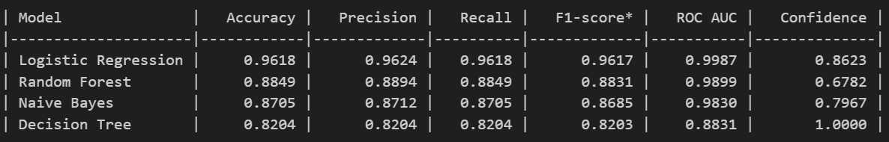

# upGrad - Customer Support Ticket Classification using NLP

## Introduction

This project aims to automate customer support ticket classification for a financial company using NLP techniques. The objective is to classify unstructured customer complaints into predefined categories to streamline the support process. The categories include:

- **Credit card/Prepaid card**
- **Bank account services**
- **Theft/Dispute reporting**
- **Mortgages/loans**
- **Others**

The notebook follows a structured workflow, encompassing the following major stages:

1. **Data Reading and Understanding**  
2. **Data Cleaning**  
3. **Text Preprocessing**  
4. **Exploratory Data Analysis (EDA)**  
5. **Feature Extraction**  
6. **Topic Modeling**  
7. **Model Building**  
8. **Best Model**  
9. **Model Inference**

The data provided is in **JSON format**, and it is efficiently loaded into a Pandas DataFrame for further processing.

---

## Exploratory Data Analysis (EDA)

### Word Cloud


---

## Model Performance Summary

The following models were trained to classify the customer complaints:

- **Logistic Regression**
- **Random Forest**
- **Naive Bayes**
- **Decision Tree**

### Performance Overview

Logistic Regression outperformed the other models across all key metrics, demonstrating superior accuracy, precision, and recall. The performance ranking of the models based on overall effectiveness is:

1. **Logistic Regression** - Best performing model with the highest scores across accuracy, precision, recall, and F1-score.
2. **Random Forest** - Good performance but slightly lower than Logistic Regression in all metrics.
3. **Naive Bayes** - Moderate performance with a balance of precision and recall.
4. **Decision Tree** - Lowest performance, prone to overfitting, resulting in lower generalization.

### Model Performance Table



---

## Conclusion

The Logistic Regression model was selected as the best-performing model due to its high accuracy and robust generalization capabilities. Future improvements could include hyperparameter tuning and exploring deep learning approaches for further enhancements.

---

## Requirements

Install the required dependencies using:  
   ```bash
   pip install -r requirements.txt
