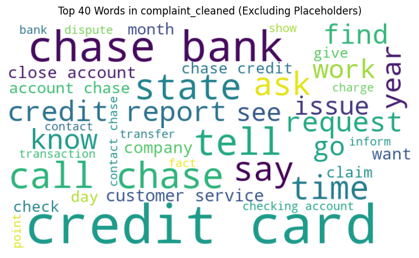
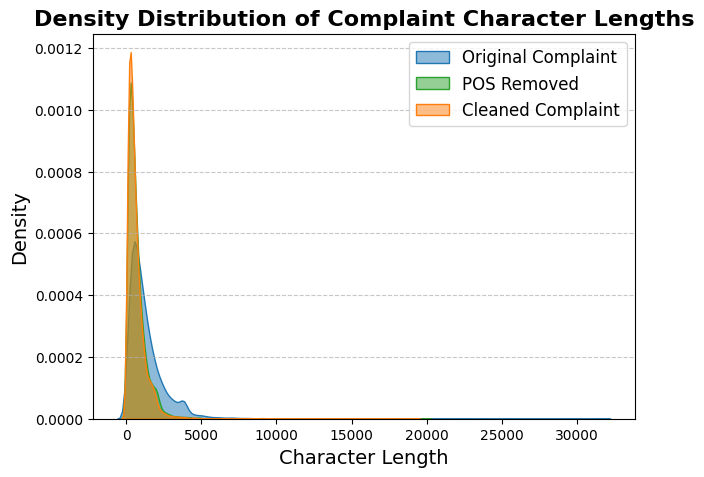

# upGrad - Customer Support Ticket Classification using NLP

## Introduction

This project aims to automate customer support ticket classification for a financial company using NLP techniques. The objective is to classify unstructured customer complaints into predefined categories to streamline the support process. The categories include:

- **Credit card/Prepaid card**
- **Bank account services**
- **Theft/Dispute reporting**
- **Mortgages/loans**
- **Others**

The notebook follows a structured workflow, encompassing the following major stages:

1. **Data Reading and Understanding**  
2. **Data Cleaning**  
3. **Text Preprocessing**  
4. **Exploratory Data Analysis (EDA)**  
5. **Feature Extraction**  
6. **Topic Modeling**  
7. **Model Building**  
8. **Best Model**  
9. **Model Inference**

The data provided is in **JSON format**, and it is efficiently loaded into a Pandas DataFrame for further processing.

---

## Exploratory Data Analysis (EDA)

### Word Cloud




### Complaint Length




---

## Topic Modeling

| Topic | Count | Label                      | Top Words                                                                                                           |
|-------|-------|----------------------------|--------------------------------------------------------------------------------------------------------------------|
| 0     | 5787  | Bank account services       | account, check, bank, chase, money, deposit, fund, close, tell, branch, open, say, chase bank, day, transaction, checking, transfer, claim, close account, number |
| 1     | 6134  | Credit card / Prepaid card  | card, charge, credit card, credit, chase, dispute, purchase, use, receive, merchant, chase credit card, transaction, refund, service, chase credit card, company, fraud, tell, say, pay |
| 2     | 4132  | Mortgages / Loans           | loan, mortgage, chase, home, modification, property, letter, send, document, year, foreclosure, request, time, sale, receive, house, rate, tell, pay, loan modification |
| 3     | 2535  | Theft / Dispute reporting   | report, credit, inquiry, credit report, hard, remove, hard inquiry, inquiry credit, account, inquiry credit report, bureau, debt, credit bureau, reporting, score, card, information, hard inquiry credit, hard inquiry credit report, identity |
| 4     | 2564  | Others                      | payment, pay, late, make, fee, balance, make payment, month, late payment, late fee, statement, payment make, account, monthly, chase, credit, payment chase, time, day, auto |


---

## Model Performance Summary

The following models were trained to classify the customer complaints:

- **Logistic Regression**
- **Random Forest**
- **Naive Bayes**
- **Decision Tree**

### Performance Overview

Logistic Regression outperformed the other models across all key metrics, demonstrating superior accuracy, precision, and recall. The performance ranking of the models based on overall effectiveness is:

1. **Logistic Regression** - Best performing model with the highest scores across accuracy, precision, recall, and F1-score.
2. **Random Forest** - Good performance but slightly lower than Logistic Regression in all metrics.
3. **Naive Bayes** - Moderate performance with a balance of precision and recall.
4. **Decision Tree** - Lowest performance, prone to overfitting, resulting in lower generalization.

### Model Performance Summary

| Model               | Accuracy | Precision | Recall  | F1-score* | ROC AUC | Confidence |
|--------------------|----------|-----------|---------|----------|---------|------------|
| Logistic Regression| 0.9618    | 0.9624    | 0.9618  | 0.9617   | 0.9987  | 0.8623     |
| Random Forest      | 0.8849    | 0.8894    | 0.8849  | 0.8831   | 0.9899  | 0.6782     |
| Naive Bayes        | 0.8705    | 0.8712    | 0.8705  | 0.8685   | 0.9830  | 0.7967     |
| Decision Tree      | 0.8204    | 0.8204    | 0.8204  | 0.8203   | 0.8831  | 1.0000     |

*sorted on F1-score

---

## Conclusion

The Logistic Regression model was selected as the best-performing model due to its high accuracy and robust generalization capabilities. Future improvements could include hyperparameter tuning and exploring deep learning approaches for further enhancements.

---

## Requirements

Install the required dependencies using:  
   ```bash
   pip install -r requirements.txt
